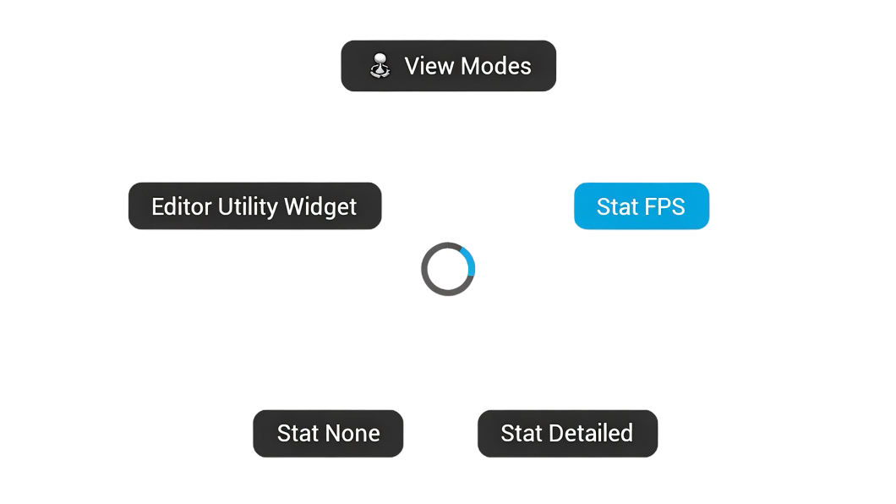

# PiUE - Pie Menu for Unreal Editor

Blender-style radial quick-action menu for the Unreal Engine level editor viewport.

### Installation

Clone into your project's `Plugins/` folder and build. Free and open-source.

Prebuilt binary available on [Fab](https://fab.com/s/3b282c27a17e) if you'd like to support the project.

## Usage

PiUE supports up to **five independent rings**, each bound to its own hotkey. Press the bound key to open that ring. **Tap** (< `Tap Threshold`) leaves the menu open - click a wedge or press again to close. **Hold** (≥ `Tap Threshold`) executes the highlighted wedge on release. Move the cursor away from center to highlight a wedge; stay in the dead zone to close without acting.

By default each ring only opens when the cursor is directly over the **level viewport** (or the **PIE viewport** during play) - z-order is respected, so the menu will not trigger when another tab (Blueprint graph, Details, etc.) is docked over the viewport area. Disable **Viewport Only** on a ring to allow it to open in any editor window.

**Ring 1** defaults to **V**. Rings 2 - 5 are unbound by default.

PiUE works during Play In Editor as long as at least one item in the ring has the **PIE / Game** mode bit set. Each item declares its own visibility via the **Mode** bitmask (Editor and/or PIE), so a single ring can hold both editor-only and PIE-only commands - the menu shows only the items applicable to the current mode. Bind PIE-enabled rings to keys that don't conflict with in-game input.

> All ring bindings can be rebound in **Editor Preferences → General → Keyboard Shortcuts → PiUE**.

## Configuration

**Editor Preferences → Plugins → PiUE**

### Menu

Each ring has three settings:

| Property | Default | Description |
|----------|---------|-------------|
| **Title** | - | Optional text drawn above the small center ring at the root level. Empty = no title. |
| **Items** | - | Wedges shown when this ring is opened. |
| **Viewport Only** | `true` | When on, the ring only opens when the cursor is directly over the level viewport (or PIE viewport during play); tabs docked on top occlude the trigger. When off, it opens in any editor window. |

### Input

| Property | Default | Unit | Description |
|----------|---------|------|-------------|
| **Tap Threshold** | `100` | ms | Short press leaves the menu open for click navigation. Long press executes the hovered wedge on release. |
| **Category Hover Ms** | `300` | ms | How long a category wedge must be hovered before auto-navigating into it. |

### Layout

| Property | Default | Description |
|----------|---------|-------------|
| **Menu Radius** | `120` | Ring radius in screen pixels. |
| **Dead Zone Radius** | `25` | Cursor distance from center below which nothing is selected. |
| **Menu Scale** | `1.0` | Overall multiplier on the menu visuals and hit-test region. Use to make the whole pie larger or smaller without retuning every other size. |

### Animation

| Property | Default | Unit | Description |
|----------|---------|------|-------------|
| **Wedge Exit Duration** | `130` | ms | Duration of the wedge exit animation when the menu closes or navigates. |
| **Wedge Anim Speed** | `25` | ×/s | Speed multiplier for wedge enter/exit translation animation. Higher = snappier. |
| **Highlight Anim Speed** | `20` | ×/s | Speed multiplier for wedge highlight color transition. Higher = snappier. |
| **Arc Track Speed** | `18` | ×/s | Speed multiplier for the arc indicator tracking the hovered wedge. Higher = snappier. |
| **Arc Fade Speed** | `10` | ×/s | Speed multiplier for the arc indicator fade in/out. Higher = snappier. |

### Style

| Property | Default | Description |
|----------|---------|-------------|
| **Icon Picker Size** | `16` | Size of icons in the editor icon picker grid (pixels). |
| **Default Wedge Tint** | - | Background color for unselected wedges. |
| **Highlight Wedge Tint** | - | Background color for the hovered wedge. |

## Item Types

All item types share these base properties:

| Property | Description |
|----------|-------------|
| **Label** | Text shown on the wedge. Keep short. |
| **Icon** | Optional Slate SVG icon drawn beside the label. Select via the icon picker. |
| **Background Tint** | Overrides the wedge background color. Unset = use theme default. |
| **Bold** | Renders the label in bold. |
| **Mode** | Bitmask of when the item is visible: **Editor**, **PIE / Game**, or both (default). Items whose mode does not include the current context are hidden. |

### Editor Command
Executes an editor command mapped by the main frame, level editor, or current level viewport command list.

- **Command Context** - binding context (e.g. `LevelEditor`)
- **Command Name** - command key within that context (e.g. `PlayInViewport`)

Use the command picker dropdown to browse and search commands that PiUE can route through those command lists.

### Console Command
Passes a string to `GEngine->Exec` against the editor world.

- **Command** - any console command (e.g. `stat fps`, `viewmode lit`)

### Editor Utility Widget
Opens an Editor Utility Widget Blueprint as a tab.

- **Widget** - soft reference to the widget blueprint asset

### Editor Utility Object
Instantiates an Editor Utility Object blueprint and calls its `Run` event.

- **Object** - soft reference to the Editor Utility Object Blueprint asset

### Open Tabs
Inline-expanding spread that emits one wedge for the current Level plus N wedges for the currently-open asset editors and standalone tabs, sorted by most recent activation.

- **Max Count** - total wedges this item emits, including Level. Clamped 1-12. Default 6 = Level + up to 5 tabs
- **Reversed** - when off, Level is first and tabs follow newest-to-oldest. When on, tabs are oldest-to-newest and Level is last
- **Show Icons** - when on, generated wedges display the source tab's icon next to the label

### Category
Groups child items into a nested ring. In hold mode, hovering the wedge for `Category Hover Ms` auto-navigates into it. In tap mode, left-clicking navigates immediately.

- **Children** - nested array of any item types, including further categories
- **Use Label As Title** - when on, this category's Label is drawn as the menu title above the center ring while inside it

### Close
Closes the current level of the menu. In a sub-ring: navigates back to the parent ring. At root: closes the menu entirely. Place it anywhere in a `Children` array to control its wedge position. Label and icon are fully customizable.
